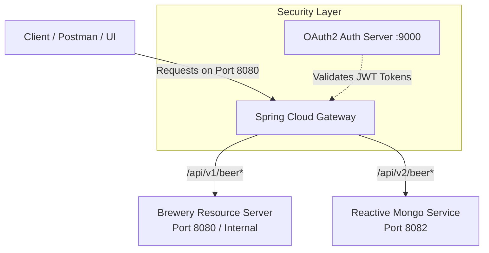

# Spring Cloud Gateway Service (`spring-6-gateway`)

> **Course Project:** Built as part of a hands-on microservices ecosystem following John Thompson's *Spring Framework 6 / Spring Boot 3* course.

## Overview

The `spring-6-gateway` microservice serves as the **API Gateway / Reverse Proxy** for the entire Brewery ecosystem. Running on port `8080`, it acts as the single entry point for client applications (web frontends, mobile apps, Postman) and routes incoming traffic dynamically to backend microservices.

It also integrates with Spring Security OAuth2 to handle JWT validation and secure downstream microservices.

## Key Features

* **Centralized Edge Routing:** Hides internal backend topologies by proxying requests dynamically based on route predicates.
* **OAuth2 Resource Server Integration:** Validates incoming OAuth2 Bearer tokens issued by the Authorization Server before proxying requests.
* **Non-Blocking Architecture:** Built on top of **Spring Cloud Gateway** and **Spring WebFlux (Netty)** for high concurrency and low latency.
* **Cross-Origin Resource Sharing (CORS):** Manages global CORS policies for frontend clients.

## Gateway Route Architecture



## Tech Stack & Dependencies

* **Java Version:** 17
* **Framework:** Spring Boot 3, Spring Cloud Gateway
* **Reactive Engine:** Spring WebFlux / Reactor / Netty
* **Security:** Spring Boot Starter OAuth2 Resource Server (JWT validation)
* **Build Tool:** Maven

## Configuration

The gateway routes and OAuth2 issuer URIs are configured in `src/main/resources/application.yml`:

```yaml
server:
  port: 8080

spring:
  cloud:
    gateway:
      routes:
        - id: brewery-mvc-service
          uri: http://localhost:8081
          predicates:
            - Path=/api/v1/beer/**, /api/v1/customer/**, /api/v1/beerorder/**
            
        - id: brewery-reactive-service
          uri: http://localhost:8082
          predicates:
            - Path=/api/v2/beer/**

  security:
    oauth2:
      resourceserver:
        jwt:
          issuer-uri: http://localhost:9000

```

## Getting Started

### Prerequisites

1. Java 17+
2. The **OAuth2 Authorization Server (`spring-6-auth-server`)** running on port `9000` (required for token verification at startup).

### Running Locally

```bash
# Clone the repository
git clone [https://github.com/JandierR/spring-6-gateway.git](https://github.com/JandierR/spring-6-gateway.git)
cd spring-6-gateway

# Run the service
./mvnw spring-boot:run

```

## Testing

Run unit and route integration tests using Maven:

```bash
./mvnw test

```
